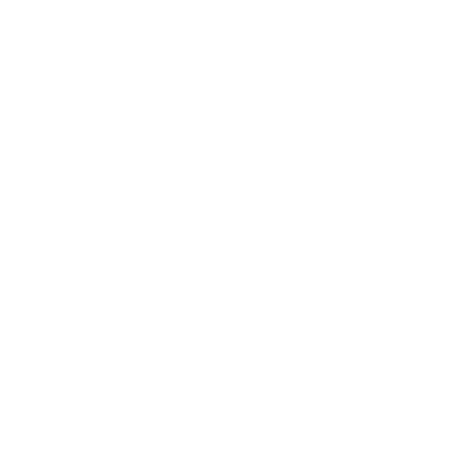

# Donna Coffee

**"Code com o melhor café da região"**

## Visão Geral

Donna Coffee é um site criado para uma cafeteria fictícia. O site tem como objetivo proporcionar aos usuários uma experiência agradável, permitindo que eles explorem o menu de cafés, aprendam mais sobre a cafeteria e realizem pedidos online.

## Tecnologias Utilizadas

- **HTML5**: Estrutura básica do site.
- **CSS3/SASS**: Estilização do site, proporcionando um design moderno e responsivo.
- **JavaScript**: Funcionalidades interativas e dinâmicas.

